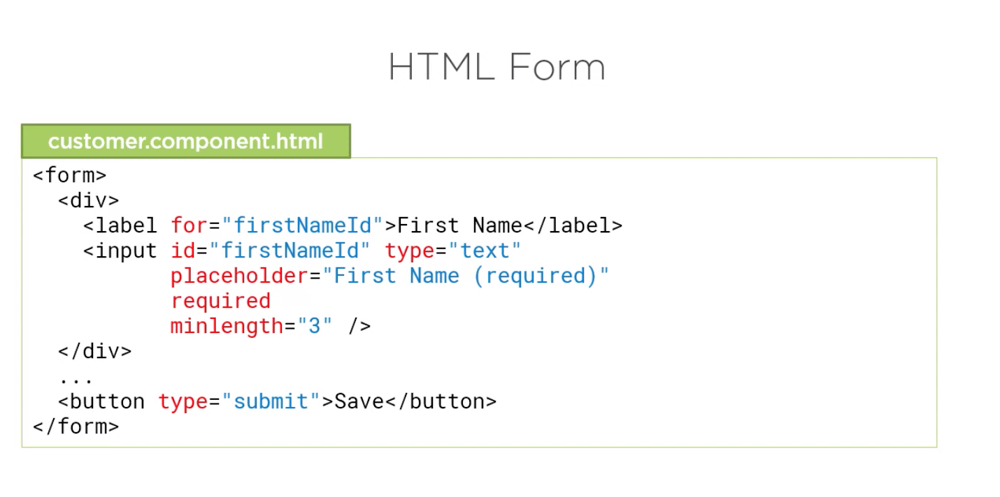
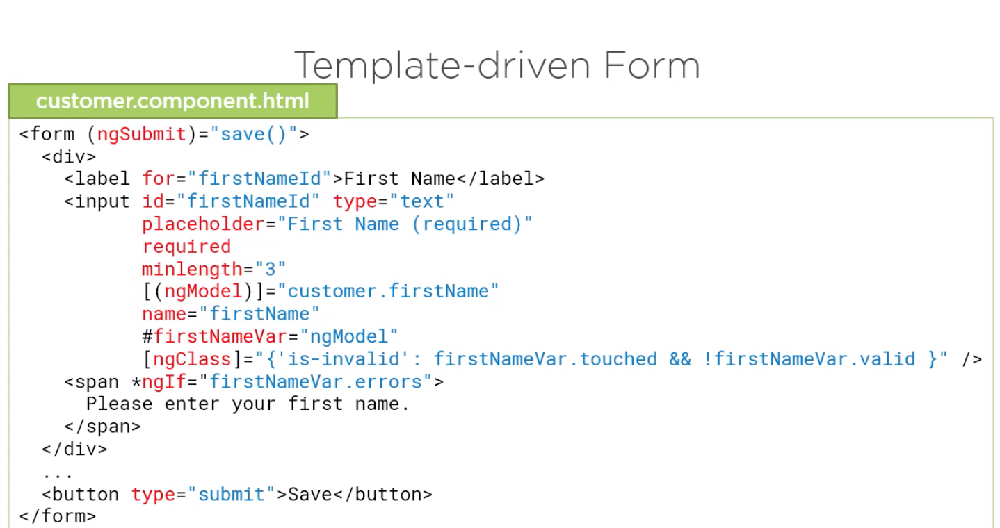
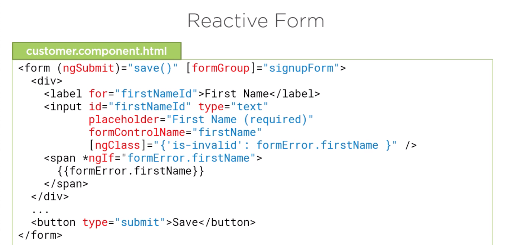

# App

- This project was generated with [Angular CLI](https://github.com/angular/angular-cli) version 8.3.2.

---

# Angular Forms:

```
Template-driven                 |   Reactive Forms
- Easy to use                   |   - More flexible =>
- Similar to AngularJS          |   more complex scenarios
- Two-way data binding          |   - Immutable data model
Minimal component code          |   - Easier to perform an
- Automatically tracks form     |   action on a value change
and input element state         |   - Reactive transformations =>
                                |   debounceTime or distinctUntilChanged
                                |   - Easily add input elements dynamically
                                |   - Easier unit testing
                                |
```

- Directives

```
Template-driven                 |   Reactive Forms
- ngForm                        |   - formGroup
- ngModel                       |   - formControl
- ngModelGroup                  |   - formControlName
                                |   - formGroupname
                                |   - formArrayName

```

- Simple HTML Form:



- Template-driven Form:



- Reactive Form:



---
