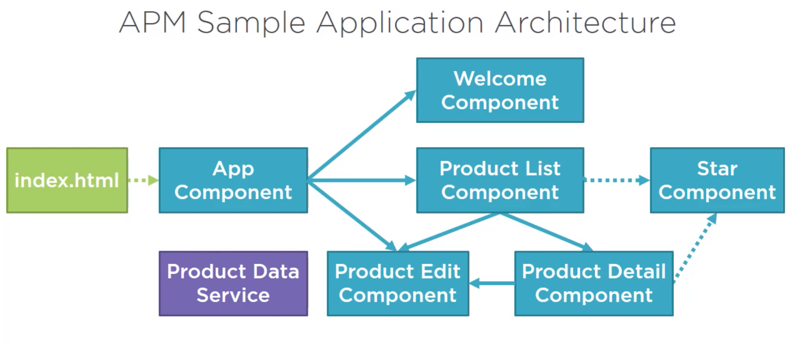
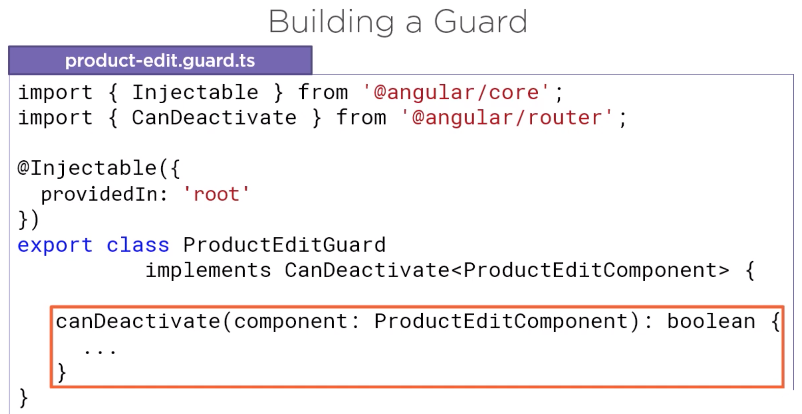

# App

- This project was generated with [Angular CLI](https://github.com/angular/angular-cli) version 8.3.2.
- **.prettierrc**

```
{
    "tabWidth": 4,
    "useTabs": false,
    "singleQuote": true
}
```

# Key concepts:
-

- FormArray:
```
import { FormArray } from '@angular/forms';
```

- Directives:
```
1. formArrayName
2. formGroupName
3. formControlName
4.

```

#### 1. Build form by a form builder:

- Import, Inject, Initialize the form.

```
import { FormBuilder } from '@angular/forms';

customerForm: FormGroup;
constructor(private fb: FormBuilder) {}

this.customerForm = this.fb.group({
    firstName: ['', [Validators.required, Validators.minLength(3)]],
    lastName: ['', [Validators.required, Validators.maxLength(50)]],
    emailGroup: this.fb.group(
        {
            email: ['', [Validators.required, Validators.email]],
            confirmEmail: ['', Validators.required]
        },
        { validator: emailMatcher }
    ),
    phone: '',
    notification: 'email',
    rating: [null, ratingRange(1, 5)],
    sendCatalog: true
});
```

#### 2. Get a form control:

```
const emailControl = this.customerForm.get('emailGroup.email');
```

#### 3. Custom validations:

```
function ratingRange(min: number, max: number): ValidatorFn {
    return (c: AbstractControl): { [key: string]: boolean } | null => {
        if (
            c.value !== null &&
            (isNaN(c.value) || c.value < min || c.value > max)
        ) {
            return { range: true };
        }
        return null;
    };
}

function emailMatcher(c: AbstractControl): { [key: string]: boolean } | null {
    const emailControl = c.get('email');
    const confirmationControl = c.get('confirmEmail');
    if (emailControl.pristine || confirmationControl.pristine) {
        return null;
    }
    if (emailControl.value === confirmationControl.value) {
        return null;
    }
    return { match: true };
}
```

#### 4. RxJS Operators:

```
import { debounceTime } from 'rxjs/operators';

const emailControl = this.customerForm.get('emailGroup.email');
emailControl.valueChanges.pipe(
        debounceTime(1000)
    )
    .subscribe(value => {
    // Reacting to the changes
    this.setMessage(emailControl);
});
```

#### 5. Benefits of FormGroup:


---

# Angular Forms:

```
Template-driven                 |   Reactive Forms
- Easy to use                   |   - More flexible =>
- Similar to AngularJS          |   more complex scenarios
- Two-way data binding          |   - Immutable data model
Minimal component code          |   - Easier to perform an
- Automatically tracks form     |   action on a value change
and input element state         |   - Reactive transformations =>
                                |   debounceTime or distinctUntilChanged
                                |   - Easily add input elements dynamically
                                |   - Easier unit testing
                                |
```

- Directives

```
Template-driven                 |   Reactive Forms
- ngForm                        |   - formGroup
- ngModel                       |   - formControl
- ngModelGroup                  |   - formControlName
                                |   - formGroupname
                                |   - formArrayName

```

- Simple HTML Form:


- Template-driven Form:


- Reactive Form:


---

# Reactive Forms Module:

- Add this to the app.module.ts

```
import { FormsModule, ReactiveFormsModule } from '@angular/forms';
...
imports: [
    ...
    FormsModule,
    ReactiveFormsModule
]
```

## 1. Create a FormGroup:


---

## 2. FormGroup & FormControl:


---

## 3. Accessing The Form Control Properties:


---

## 4. Set Value and Patch Value:


---

## 5. FormBuilder:


---

## 6. Validation:

### a) Built-in Validation Rules:


### b) Custom Validation Rules:


- Email confirmation:


---

## 7. Reacting to Changes:

### a) Watching:


### b) Reacting: Adjusting Validation Rules


### c) Reacting: Displaying Validation Messages


### d) Reacting to Changes: Reactive Transformations


---

## 8. Dynamically Duplicate Input Elements:

- Add multiple address blocks.
- FormArray:
```
import { FormArray } from '@angular/forms';
```

### a) Steps:


### b) Define the Input Element(s) to Duplicate:


### c) Define a FormGroup:


### d) Refactor:
- To make copies.


### e) Create a FormArray:
- Form Array: group of form controls or form groups.
- Differences: access through index instead of name.


### f) Loop Through the FormArray:


### g) Duplicate the Input Elements:


---

## 9. Reactive Forms in Context:

### a) Architecture:
- AppModule: Basic application and startup pieces.
- ProductModule: Product feature pieces.
- SharedModule: Sharable pieces across the app.




### b) Routing:


### c) Setting a canDeactivate Guard:




### d) Refactoring to a Custom Validation Class:


---

## 10. Reactive Forms CRUD:


---

